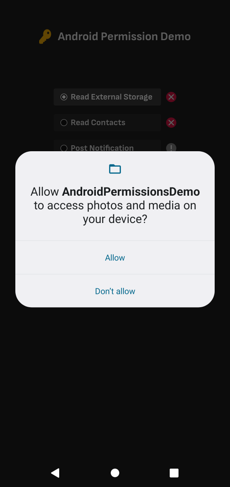
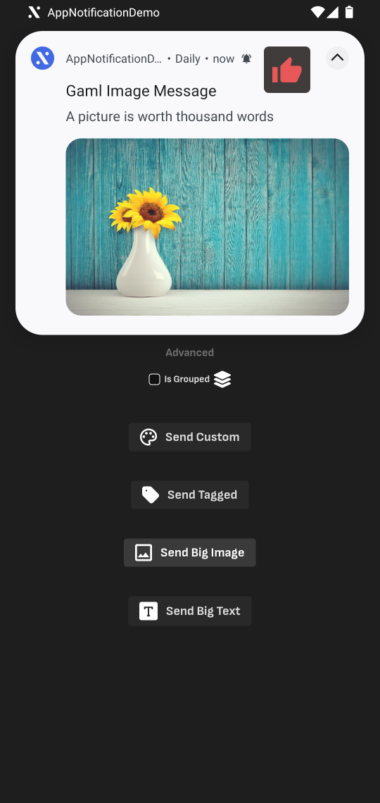
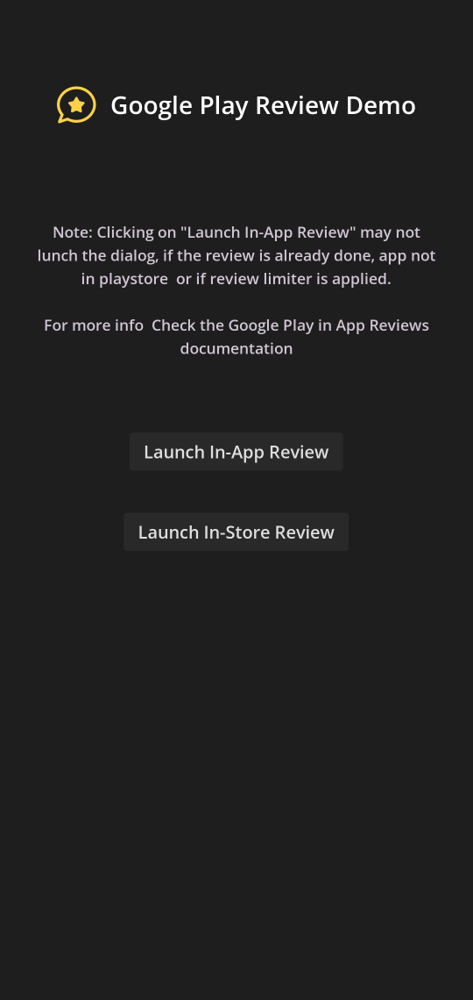

#  GAML - Demo

  

This repository lists all the example projects that can be used as reference while using 
the GAML plugins for Godot.

[GAML Plugins Repository](https://github.com/tokengamedev/godot-android-modules)

## List of Projects:

### 1. AndroidPermissionsDemo:
   
   **Target Module(s):** AndroidPermissions v2.0.0
   

### 2. AppNotificationDemo:
   
   **Target Module(s):** AppNotification v2.0.0

### 3. GooglePlayReviewDemo:
   
   **Target Module(s):** GooglePlayReview v2.0.0

> [!NOTE]
> Demo projects for Google Play Billing and Google Play Services are bit complicated and time taking. It will be added on request.
>

### Contributing and Support

If you want to contribute please send a note to [Token GameDev](token.gamedev@gmail.com) or raise a pull request.
If you are facing a problem in usage, raise an issue providing details about the problem.

Should this aid in your development and prove beneficial, feel free to spread the word. 
Your support through a modest donation on ☕ [Buying a coffee](https://www.buymeacoffee.com/tokengamedev) would be greatly valued and appreciated.